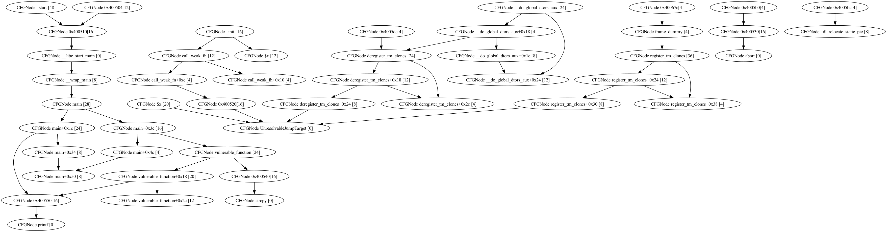

## Цель работы
Разработка алгоритма для обнаружения потенциальных уязвимостей (переполнение буфера) в скомпилированных файлах без исходного кода, используя статическое и символьное выполнение.

## Методология и ключевые этапы
### Статический анализ графа (CFG)
Для анализа структуры программы был использован инструмент angr:Нормализация графа: 

- Использован CFGFast(normalize=True). Это позволило разделить общие блоки кода и гарантировать, что каждый узел принадлежит только одной функции.

- Межпроцедурный анализ: Выявлено, что для обнаружения уязвимостей необходимо использовать глобальный граф проекта, чтобы отслеживать переходы между main и вложенными функциями.

### Алгоритмический поиск критических точек
 
Чтобы избежать проблемы «взрыва состояний» (сотни путей), вместо полного перебора была внедрена Теория доминаторов.

Суть: Узел А является критическим для узла Б, если любой путь от входа к Б обязательно проходит через А.

Результат: Математически точно выделены «узкие места» программы, которые невозможно миновать на пути к уязвимой функции.

### Поиск уязвимостей

Реализован сигнатурный поиск через таблицу импортов. Алгоритм автоматически находит вызовы опасных функций (например, strcpy, gets) и перекрестные ссылки (X-refs) на них даже в стрипнутых (stripped) бинарниках.

### Экспериментальное подтверждение (PoC)

#### Символьное выполнение (Symbolic Execution)

  С помощью Simulation Manager была предпринята попытка генерации эксплойта для подбора argv[1].

  Важное наблюдение: Обнаружена разница между логической достижимостью блока и реальной эксплуатацией.
  Первый сгенерированный Payload содержал нулевой байт в начале, что прерывало работу функции strcpy до возникновения переполнения.

**Результат успешной атаки:**

Длина строки: 50 байт (при размере буфера 16 байт).

Итог: Лишние байты гарантированно перезаписывают данные на стеке (адрес возврата или указатель кадра ebp), вызывая CRASH.

**Влияние механизмов защиты и выравнивания**

В ходе работы были выявлены факторы, искажающие границы памяти:
1. ABI Alignment: Компилятор (gcc) выравнивает переменные по границам 16/32 бита, из-за чего буферу в 16 байт фактически выделяется больше места.
2. Stack Canary: Наличие «канареек» увеличивает дистанцию, которую должен пройти ввод для изменения потока управления.

### Визуализация результатов

Для наглядности реализован экспорт графа в формат DOT (Graphviz).

Критический путь подсвечен красным/оранжевым цветом. Визуально подтверждена работа алгоритма поиска доминаторов.

# Выводы
1. Построен фундамент для автоматического разбора бинарных файлов в angr.
2. Доказано, что формальное нахождение пути до опасной функции не гарантирует уязвимость без учета специфики языка C (null-termination) и архитектуры стека.
3. Алгоритм успешно находит «Золотой путь» _(8 критических блоков)_, через которые проходит атака.

